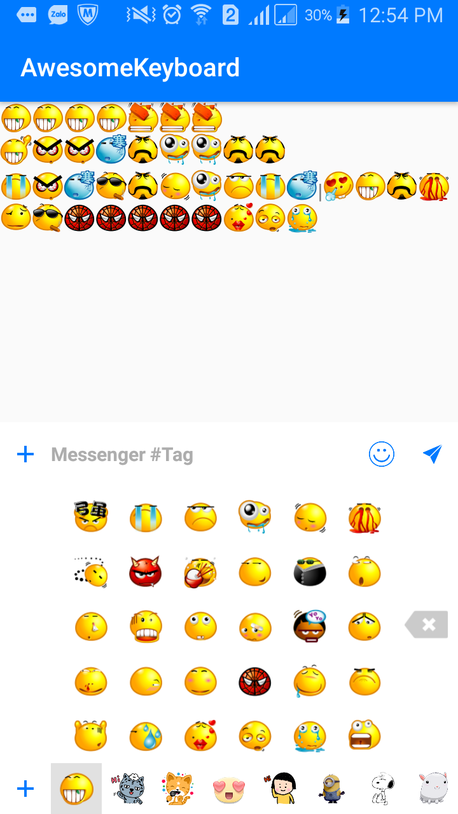
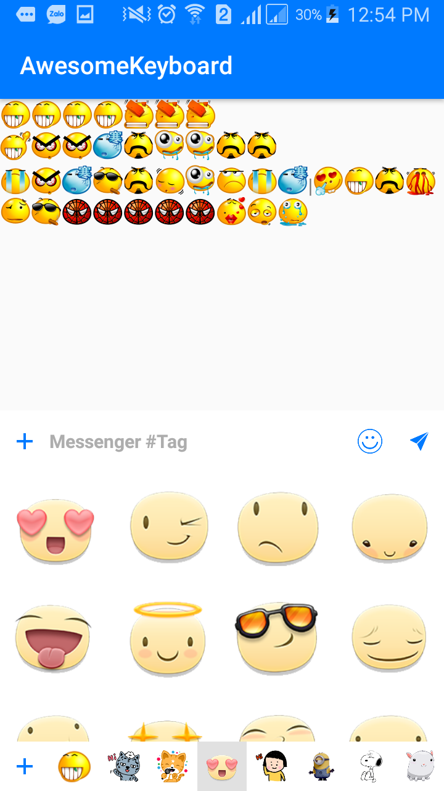
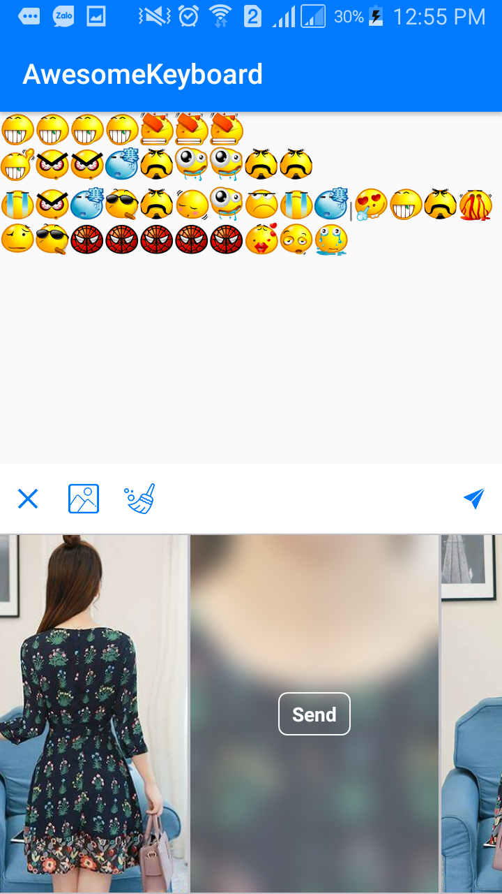
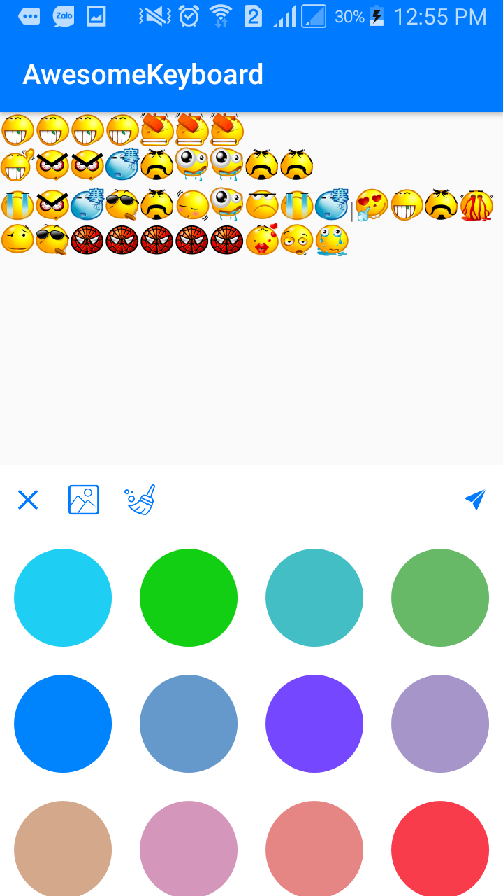
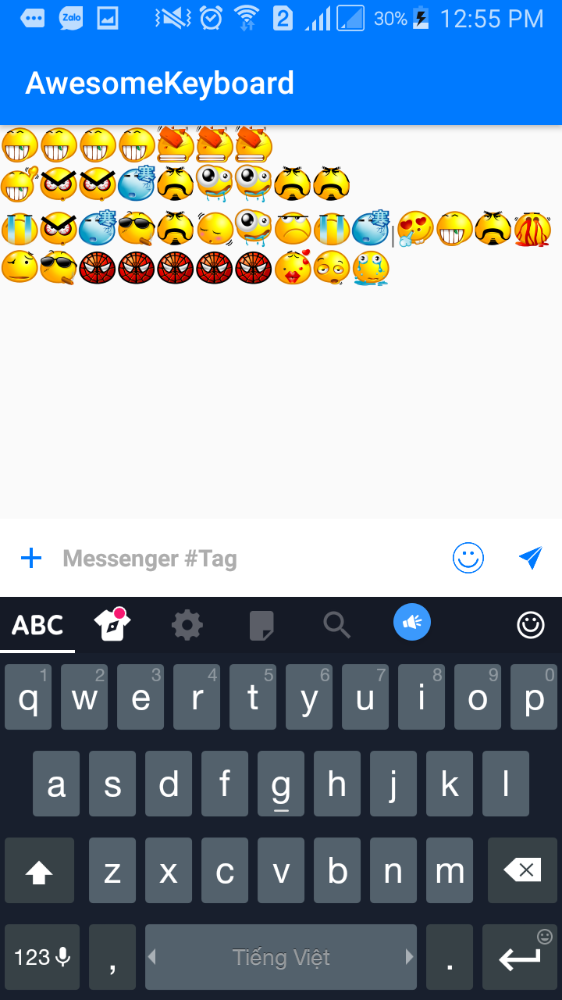

# AwesomeKeyboard
emoticons, sticker, photo and color keyboard

### I. Demo

| Emojicons | Sticker | Photo	| Color	| Nomal |
| -------- | -------- | -------- | -------- | -------- |
|    |   |    |    |    |


### II. Setting
### III. Doc

* Add
```java
 keyboard = KeyboardBuilder.with(this)
                .setKeyboardLayout(keyboardLayout)
                .setEditText(editMessage)
                .setRoot(activtyMain)
                .setOnItemColorClickListener(this)
                .setOnItemPhotoClickListener(this)
                .setOnItemStickerClickListener(this)
                .setOnKeyDownListener(this)
                .setOnShopClickListener(this)
                .builder();
```
* Show keyboard

`1. show sticker `

```java
keyboard.showKeyboard(KeyboardType.STICKER);
```
`2. show photo `

```java
keyboard.showKeyboard(KeyboardType.PHOTO);
```
`3. show color `

```java
keyboard.showKeyboard(KeyboardType.COLOR);
```
`4. show nomal `

```java
keyboard.showKeyboard(KeyboardType.NOMAL);
```
* Hide keyboard

```java
keyboard.hideAllKeyboard();
```
* Add sticker

```java
KeyboardBuilder.addSticker(this,sticker);
```
* Get sticker

```java
KeyboardBuilder.getSticker(this);
```
* Clean sticker

```java
 KeyboardBuilder.clearSticker(this);
```
* Update sticker

```java
keyboard.updateSticker();
```
* convert from text to emojicons

```java
KeyboardBuilder.convertFromTextToEmoji(this, editMessage.getText().toString());
```
