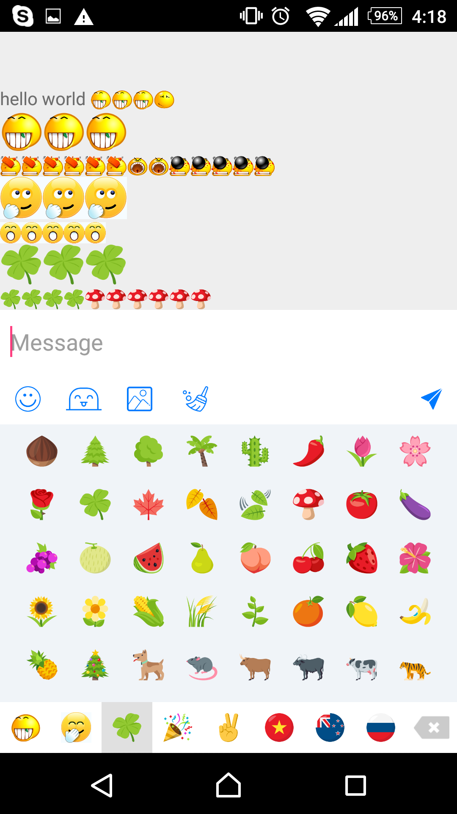
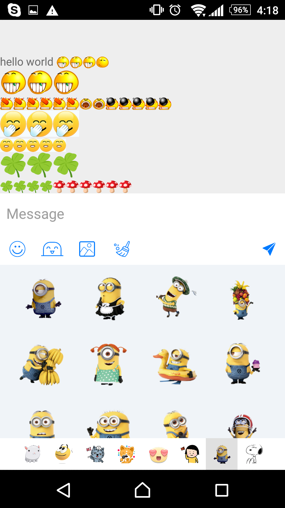
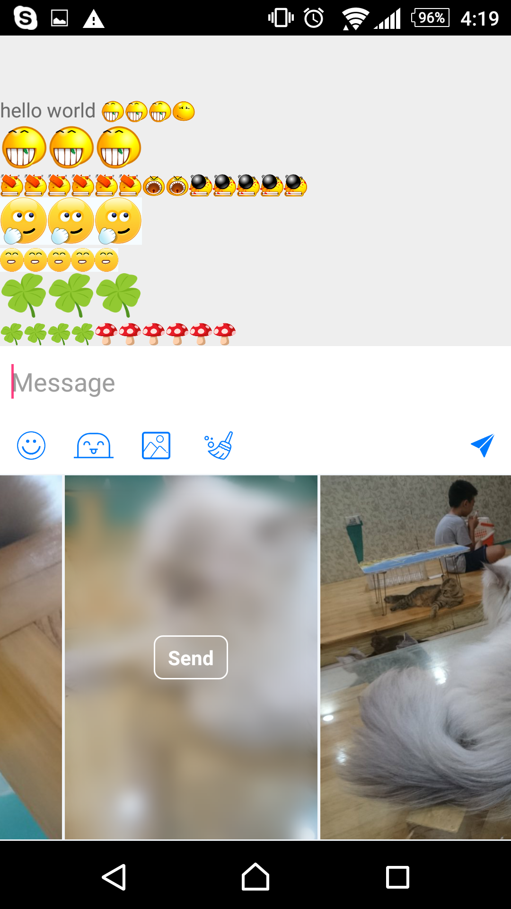
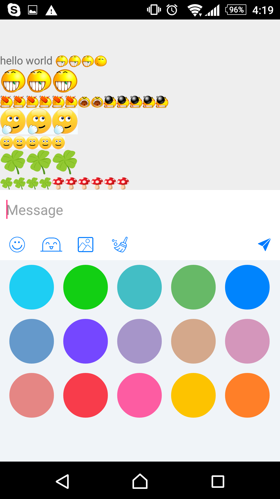
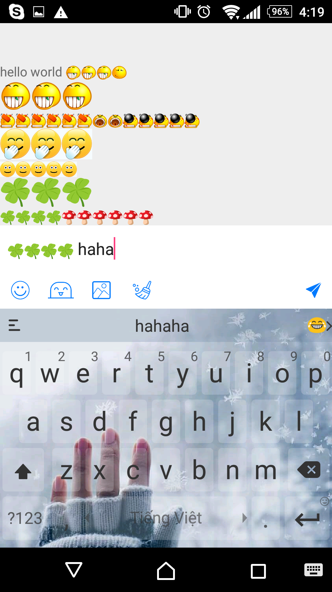
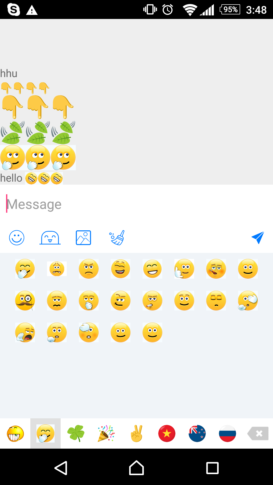

# AwesomeKeyboard

emojicons, emojicons gif ( like Skype), sticker, photo and color keyboard

### I. Demo


`apk demo`

 https://github.com/hoanganhtuan95ptit/AwesomeKeyboard/blob/master/output/app-debug.apk

 ` video demo`

 https://youtu.be/uiC-cQCVTdo
 
 ` gif demo `
 
 


| Emojicons | Sticker | Photo	| Color	| Nomal | emojicons gif |
| -------- | -------- | -------- | -------- | -------- | -------- |
|    |   |    |    |    |    |


### II. Setting

    You need to import module #Core and module #Layout
    
```java
        repositories {
                ...
                maven { url 'https://jitpack.io' }
        }  
        
        dependencies {
            compile 'com.github.hoanganhtuan95ptit.AwesomeKeyboard:layout:1.0'
        }
        
```
### III. Doc

#### 1.Add

* Application:

```java
     public class App extends Application {

         @Override
         public void onCreate() {
             super.onCreate();
             AwesomeKeyboardSdk.initialize(this, Utils.emoticons);
         }
     }
```

* Use:

```java
     private void initKeyboard() {
            keyboard = KeyboardBuilder.with(this)
                    .setRoot(reRoot)
                    .setKeyboardLayout(keyboardLayout)
                    .setOnKeyDownListener(this)
                    .addEditText(editMessage)
                    .builder();
     }
```
* EmojiconTextView:

```java
      <com.hoanganhtuan95ptit.awesomekeyboard.core.view.EmojiconTextView
         android:id="@+id/tv"
         android:layout_width="match_parent"
         android:layout_height="wrap_content" />
```
`set text`
```java
     EmojiconTextView.setText("infor");
```
* EmojiconEditText:

```java
       <com.hoanganhtuan95ptit.awesomekeyboard.core.view.EmojiconEditText
            android:id="@+id/edit_message"
            android:layout_width="match_parent"
            android:layout_height="wrap_content"
            android:background="@android:color/transparent"
            android:hint="Message"
            android:maxHeight="100dp"
            android:minHeight="50dp"
            android:padding="8dp" />
```
`set text`
```java
      @Override
     public void onItemEmoticonClicked(String key) {
         int start = editMessage.getSelectionStart();
         int end = editMessage.getSelectionEnd();
         editMessage.getEditableText().replace(start, end, key);
     }
```


* Show keyboard

`1. show sticker `

```java
        keyboard.showKeyboard(AwesomeKeyboardType.STICKER.getValue());
```
`2. show photo `

```java
       keyboard.showKeyboard(AwesomeKeyboardType.PHOTO.getValue());
```
`3. show color `

```java
        keyboard.showKeyboard(AwesomeKeyboardType.COLOR.getValue());
```
`4. show nomal `

```java
         keyboard.showKeyboard(AwesomeKeyboardType.NOMAL.getValue());
```
* Hide keyboard

```java
          keyboard.hideAllKeyboard();
```
* update Data Emoticon

```java
          keyboardLayout.updateDataEmoticon(emoticonCategories.get(i));
```
* update Data Sticker

```java
          keyboardLayout.updateDataSticker(stickerCategories.get(i));
```
* update Data Color

```java
          keyboardLayout.updateDataColor("#1ecef3");
```

### IV. Custom UI

#### 1. Intall

   You just need to import module #Core
   
```java
       repositories {
                ...
                maven { url 'https://jitpack.io' }
        }  
         dependencies {
             compile 'com.github.hoanganhtuan95ptit.AwesomeKeyboard:core:1.0'
         }
```

#### 2. Extends `KeyboardLayout` [Tutorial](https://github.com/hoanganhtuan95ptit/AwesomeKeyboard/blob/master/layout/src/main/java/com/hoanganhtuan95ptit/awesomekeyboard/layout/AwesomeKeyboardLayout.java) 

```java
         public abstract class KeyboardLayout extends RelativeLayout {

             private static final String TAG = "KeyboardLayout";

             public KeyboardLayout(Context context) {
                 super(context);
             }

             public KeyboardLayout(Context context, AttributeSet attrs) {
                 super(context, attrs);
             }

             public KeyboardLayout(Context context, AttributeSet attrs, int defStyleAttr) {
                 super(context, attrs, defStyleAttr);
             }

             public void showKeyboard(int type){
                 // TODO: 7/21/2017 do something 
             }
         }
```
#### 3. Init data for `EmojiconConstant.emoticons` [Tutorial](https://github.com/hoanganhtuan95ptit/AwesomeKeyboard/blob/master/layout/src/main/java/com/hoanganhtuan95ptit/awesomekeyboard/layout/AwesomeKeyboardSdk.java) 

```java
        //tutorial
        public class AwesomeKeyboardSdk {

            private AwesomeKeyboardSdk(Context context, HashMap<String, String> emoticons) {
                EmojiconConstant.emoticons = emoticons;
                Fresco.initialize(context);
            }

            private static AwesomeKeyboardSdk awesomeKeyboard;

            public static void initialize(Context context, HashMap<String, String> emoticons) {
                if (awesomeKeyboard == null) awesomeKeyboard = new AwesomeKeyboardSdk(context, emoticons);
            }
        }
```

### V. Thank

| Developer | Project |
| -------- | -------- |
|  [Waynejo](https://github.com/waynejo)  | [Android-ndk-gif](https://github.com/waynejo/android-ndk-gif)   | 
|  [Ogaclejapan](https://github.com/ogaclejapan)  | [SmartTabLayout](https://github.com/ogaclejapan/SmartTabLayout)   | 
| [Wasabeef](https://github.com/wasabeef)   |  [Blurry](https://github.com/wasabeef/Blurry)  | 

## License

    Apache Version 2.0
    Copyright 2017 HoangAnhTuan95ptit (hoanganhtuan95ptit@gmail.com)

    Licensed under the Apache License, Version 2.0 (the "License");
    you may not use this file except in compliance with the License.
    You may obtain a copy of the License at

     http://www.apache.org/licenses/LICENSE-2.0

    Unless required by applicable law or agreed to in writing, software
    distributed under the License is distributed on an "AS IS" BASIS,
    WITHOUT WARRANTIES OR CONDITIONS OF ANY KIND, either express or implied.
    See the License for the specific language governing permissions and
    limitations under the License.
